# Diagramme de Classes UML - MarketCraft

Description : Représentation complète des classes du domaine métier de MarketCraft, une plateforme e-commerce artisanale. Ce diagramme montre toutes les entités, leurs attributs typés, leurs méthodes et l'ensemble des relations entre elles.

```mermaid
classDiagram
    direction TB

    class Utilisateur {
        +Int id
        +String nom
        +String prenom
        +String email
        +String motDePasseHash
        +String telephone
        +enum role
        +Boolean estActif
        +DateTime dateInscription
        +DateTime derniereConnexion
        +String tokenReset
        +DateTime tokenResetExpiration
        +seConnecter(email, motDePasse) String
        +seDeconnecter() void
        +reinitialiserMotDePasse(token, nouveau) Boolean
        +mettreAJourProfil(donnees) Utilisateur
        +verifierEmail(token) Boolean
        +obtenirCommandes() Commande[]
        +obtenirAvis() Avis[]
    }

    class Boutique {
        +Int id
        +Int utilisateurId
        +String nom
        +String slug
        +String description
        +String logo
        +String banniere
        +enum statut
        +Float noteMoyenne
        +Int nombreVentes
        +DateTime dateCreation
        +DateTime dateMiseAJour
        +String adresse
        +String ville
        +String codePostal
        +String pays
        +String siret
        +creer(donnees) Boutique
        +mettreAJour(donnees) Boutique
        +activer() void
        +suspendre(raison) void
        +obtenirProduits() Produit[]
        +obtenirStatistiques() Object
        +calculerNoteMoyenne() Float
    }

    class Categorie {
        +Int id
        +Int parentId
        +String nom
        +String slug
        +String description
        +String icone
        +String image
        +Int ordre
        +Boolean estActive
        +obtenirProduits() Produit[]
        +obtenirSousCategories() Categorie[]
        +obtenirChemin() Categorie[]
    }

    class Produit {
        +Int id
        +Int boutiqueId
        +Int categorieId
        +String nom
        +String slug
        +String description
        +String descriptionCourte
        +Float prix
        +Float prixPromo
        +Int stock
        +Int stockMinimum
        +String[] images
        +String[] tags
        +enum statut
        +Boolean estMisEnAvant
        +Float poids
        +String dimensions
        +Float noteMoyenne
        +Int nombreAvis
        +DateTime dateCreation
        +DateTime dateMiseAJour
        +creer(donnees) Produit
        +mettreAJour(donnees) Produit
        +publier() void
        +archiver() void
        +mettreAJourStock(quantite) void
        +estDisponible() Boolean
        +obtenirAvis() Avis[]
        +appliquerPromotion(prix) void
    }

    class LigneCommande {
        +Int id
        +Int commandeId
        +Int produitId
        +String nomProduit
        +Float prixUnitaire
        +Int quantite
        +Float sousTotal
        +String[] optionsChoisies
        +calculerSousTotal() Float
        +obtenirProduit() Produit
    }

    class Commande {
        +Int id
        +Int acheteurId
        +Int adresseId
        +String reference
        +enum statut
        +Float sousTotal
        +Float fraisLivraison
        +Float taxe
        +Float total
        +String modeLivraison
        +String numeroDeSuivi
        +String notes
        +DateTime dateCommande
        +DateTime dateExpedition
        +DateTime dateLivraison
        +DateTime dateMiseAJour
        +calculerTotal() Float
        +changerStatut(nouveauStatut) void
        +annuler(raison) Boolean
        +ajouterSuivi(numero) void
        +obtenirLignes() LigneCommande[]
        +obtenirPaiement() Paiement
        +genererFacture() PDF
    }

    class Paiement {
        +Int id
        +Int commandeId
        +String stripePaymentIntentId
        +String stripeChargeId
        +Float montant
        +String devise
        +enum statut
        +String methode
        +String derniers4Chiffres
        +String marqueCarteAlias
        +DateTime datePaiement
        +DateTime dateRemboursement
        +String raisonEchec
        +capturer() Boolean
        +rembourser(montant) Boolean
        +libererVersVendeur() Boolean
        +verifierStatut() enum
    }

    class Avis {
        +Int id
        +Int produitId
        +Int utilisateurId
        +Int commandeId
        +Int note
        +String titre
        +String commentaire
        +String[] photos
        +Boolean estVerifie
        +Boolean estVisible
        +Int nombreUtiles
        +DateTime dateCreation
        +DateTime dateMiseAJour
        +String reponseVendeur
        +DateTime dateReponseVendeur
        +valider() void
        +masquer(raison) void
        +ajouterReponse(texte) void
        +marquerUtile() void
    }

    class AdresseLivraison {
        +Int id
        +Int utilisateurId
        +String nom
        +String prenom
        +String entreprise
        +String ligne1
        +String ligne2
        +String ville
        +String codePostal
        +String region
        +String pays
        +String telephone
        +Boolean estParDefaut
        +valider() Boolean
        +formaterPourEnvoi() String
    }

    class Role {
        <<enumeration>>
        ACHETEUR
        VENDEUR
        ADMIN
        SUPER_ADMIN
    }

    class StatutBoutique {
        <<enumeration>>
        EN_ATTENTE
        ACTIVE
        SUSPENDUE
        FERMEE
    }

    class StatutProduit {
        <<enumeration>>
        BROUILLON
        PUBLIE
        EN_RUPTURE
        ARCHIVE
    }

    class StatutCommande {
        <<enumeration>>
        EN_ATTENTE_PAIEMENT
        PAYEE
        EN_PREPARATION
        EXPEDIEE
        LIVREE
        ANNULEE
        REMBOURSEE
    }

    class StatutPaiement {
        <<enumeration>>
        EN_ATTENTE
        CAPTURE
        LIBERE
        REMBOURSE
        ECHOUE
    }

    %% Relations
    Utilisateur "1" --> "0..1" Boutique : possède
    Utilisateur "1" --> "0..*" Commande : passe
    Utilisateur "1" --> "0..*" Avis : rédige
    Utilisateur "1" --> "0..*" AdresseLivraison : a

    Boutique "1" *-- "0..*" Produit : contient

    Categorie "1" --> "0..*" Produit : classe
    Categorie "0..1" --> "0..*" Categorie : sous-catégorie de

    Commande "1" *-- "1..*" LigneCommande : composée de
    Commande "1" --> "1" AdresseLivraison : livrée à
    Commande "1" *-- "1" Paiement : réglée par

    LigneCommande "0..*" --> "1" Produit : référence

    Avis "0..*" --> "1" Produit : concerne
    Avis "0..*" --> "0..1" Commande : issu de

    Utilisateur --> Role : a
    Boutique --> StatutBoutique : a
    Produit --> StatutProduit : a
    Commande --> StatutCommande : a
    Paiement --> StatutPaiement : a
```

## Légende

| Symbole | Signification |
|---------|---------------|
| `+` | Attribut ou méthode public |
| `*--` | Composition (l'enfant ne peut exister sans le parent) |
| `-->` | Association dirigée |
| `"1" ... "0..*"` | Multiplicités (un à zéro-ou-plusieurs) |
| `<<enumeration>>` | Type énuméré |
| `enum` | Champ dont le type est une énumération |
| `Float` | Nombre décimal (prix, notes) |
| `DateTime` | Horodatage complet |
| `String[]` | Tableau de chaînes (images, tags) |

### Rôles utilisateur
- **ACHETEUR** : peut parcourir, acheter, laisser des avis
- **VENDEUR** : possède une boutique, gère ses produits et commandes
- **ADMIN** : valide les boutiques, gère les litiges
- **SUPER_ADMIN** : accès total à la plateforme

### Flux de composition clés
- Une `Commande` ne peut exister sans son `Paiement`
- Les `LigneCommande` sont détruites si la `Commande` est supprimée
- Les `Produit` appartiennent à une `Boutique` et disparaissent avec elle
