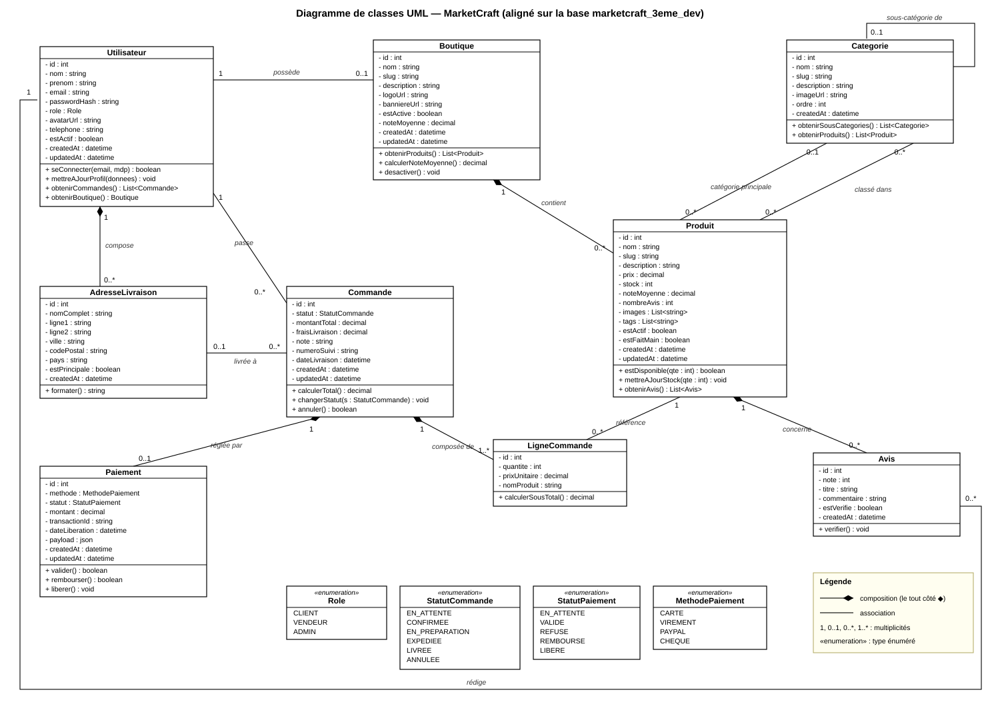
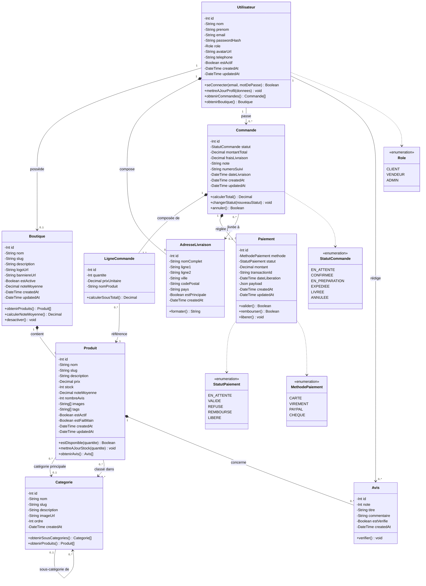

# Diagramme de Classes UML - MarketCraft

Description : Représentation des classes du domaine métier de MarketCraft, alignée sur le schéma réel de la base `marketcraft_3eme_dev` (voir `13_merise_mpd.md` / `marketcraft-backend/migrations.sql`). Chaque classe montre ses attributs typés, ses méthodes et les relations (associations, compositions) avec leurs multiplicités.

> **Version UML classique** : le même diagramme au format image est disponible dans [`01_uml_classes.svg`](01_uml_classes.svg).

> **Note de modélisation** : conformément à l'UML, les clés étrangères (`commandeId`, `produitId`…) n'apparaissent pas comme attributs — ce sont les associations qui portent les liens. Elles ne réapparaissent qu'au niveau physique (MPD). Les tables techniques `lignes_commande` et `produit_categorie` du MPD correspondent ici respectivement à la classe `LigneCommande` (association porteuse d'attributs) et à l'association N-N `Produit` ↔ `Categorie`.

```mermaid
classDiagram
    direction TB

    class Utilisateur {
        -Int id
        -String nom
        -String prenom
        -String email
        -String passwordHash
        -Role role
        -String avatarUrl
        -String telephone
        -Boolean estActif
        -DateTime createdAt
        -DateTime updatedAt
        +seConnecter(email, motDePasse) Boolean
        +mettreAJourProfil(donnees) void
        +obtenirCommandes() Commande[]
        +obtenirBoutique() Boutique
    }

    class Boutique {
        -Int id
        -String nom
        -String slug
        -String description
        -String logoUrl
        -String banniereUrl
        -Boolean estActive
        -Decimal noteMoyenne
        -DateTime createdAt
        -DateTime updatedAt
        +obtenirProduits() Produit[]
        +calculerNoteMoyenne() Decimal
        +desactiver() void
    }

    class Categorie {
        -Int id
        -String nom
        -String slug
        -String description
        -String imageUrl
        -Int ordre
        -DateTime createdAt
        +obtenirSousCategories() Categorie[]
        +obtenirProduits() Produit[]
    }

    class Produit {
        -Int id
        -String nom
        -String slug
        -String description
        -Decimal prix
        -Int stock
        -Decimal noteMoyenne
        -Int nombreAvis
        -String[] images
        -String[] tags
        -Boolean estActif
        -Boolean estFaitMain
        -DateTime createdAt
        -DateTime updatedAt
        +estDisponible(quantite) Boolean
        +mettreAJourStock(quantite) void
        +obtenirAvis() Avis[]
    }

    class LigneCommande {
        -Int id
        -Int quantite
        -Decimal prixUnitaire
        -String nomProduit
        +calculerSousTotal() Decimal
    }

    class Commande {
        -Int id
        -StatutCommande statut
        -Decimal montantTotal
        -Decimal fraisLivraison
        -String note
        -String numeroSuivi
        -DateTime dateLivraison
        -DateTime createdAt
        -DateTime updatedAt
        +calculerTotal() Decimal
        +changerStatut(nouveauStatut) void
        +annuler() Boolean
    }

    class Paiement {
        -Int id
        -MethodePaiement methode
        -StatutPaiement statut
        -Decimal montant
        -String transactionId
        -DateTime dateLiberation
        -Json payload
        -DateTime createdAt
        -DateTime updatedAt
        +valider() Boolean
        +rembourser() Boolean
        +liberer() void
    }

    class Avis {
        -Int id
        -Int note
        -String titre
        -String commentaire
        -Boolean estVerifie
        -DateTime createdAt
        +verifier() void
    }

    class AdresseLivraison {
        -Int id
        -String nomComplet
        -String ligne1
        -String ligne2
        -String ville
        -String codePostal
        -String pays
        -Boolean estPrincipale
        -DateTime createdAt
        +formater() String
    }

    class Role {
        <<enumeration>>
        CLIENT
        VENDEUR
        ADMIN
    }

    class StatutCommande {
        <<enumeration>>
        EN_ATTENTE
        CONFIRMEE
        EN_PREPARATION
        EXPEDIEE
        LIVREE
        ANNULEE
    }

    class StatutPaiement {
        <<enumeration>>
        EN_ATTENTE
        VALIDE
        REFUSE
        REMBOURSE
        LIBERE
    }

    class MethodePaiement {
        <<enumeration>>
        CARTE
        VIREMENT
        PAYPAL
        CHEQUE
    }

    %% Relations
    Utilisateur "1" --> "0..1" Boutique : possède
    Utilisateur "1" *-- "0..*" AdresseLivraison : compose
    Utilisateur "1" --> "0..*" Commande : passe
    Utilisateur "1" --> "0..*" Avis : rédige

    Boutique "1" *-- "0..*" Produit : contient

    Produit "0..*" --> "0..1" Categorie : catégorie principale
    Produit "0..*" --> "0..*" Categorie : classé dans
    Categorie "0..1" --> "0..*" Categorie : sous-catégorie de

    Commande "1" *-- "1..*" LigneCommande : composée de
    Commande "1" *-- "0..1" Paiement : réglée par
    Commande "0..*" --> "0..1" AdresseLivraison : livrée à

    LigneCommande "0..*" --> "1" Produit : référence

    Produit "1" *-- "0..*" Avis : concerne

    Utilisateur ..> Role
    Commande ..> StatutCommande
    Paiement ..> StatutPaiement
    Paiement ..> MethodePaiement
```

## Légende

| Symbole | Signification |
|---------|---------------|
| `-` / `+` | Attribut privé / méthode publique |
| `*--` | Composition (l'enfant ne peut exister sans le parent, losange plein côté « tout ») |
| `-->` | Association dirigée |
| `..>` | Dépendance (utilise le type) |
| `"1" ... "0..*"` | Multiplicités (lues à l'extrémité opposée) |
| `<<enumeration>>` | Type énuméré (traduit en `ENUM` MySQL au MPD) |
| `Decimal` | Nombre décimal exact (prix, notes) — `DECIMAL` en base |
| `DateTime` | Horodatage complet |
| `String[]` | Tableau de chaînes (images, tags) — `JSON` en base |

### Rôles utilisateur
- **CLIENT** : peut parcourir, acheter, laisser des avis
- **VENDEUR** : possède au plus une boutique, gère ses produits et commandes
- **ADMIN** : administre la plateforme (utilisateurs, boutiques, litiges)

### Règles de gestion portées par le diagramme
- Un utilisateur possède **au plus une** boutique (`0..1`).
- Une `Commande` contient au moins une `LigneCommande` (`1..*`) ; les lignes sont détruites avec la commande (composition ↔ `ON DELETE CASCADE`).
- Le `Paiement` n'existe qu'une fois la commande réglée (`0..1`) et disparaît avec elle.
- Les `Produit` appartiennent à une `Boutique` et disparaissent avec elle.
- Un `Avis` est en composition avec son `Produit` (supprimé avec lui) ; le lien vers `Utilisateur` est une association simple. Un utilisateur ne peut laisser qu'un avis par produit (contrainte UNIQUE au MPD).
- `LigneCommande` conserve `nomProduit` et `prixUnitaire` en **snapshot** : la facture reste exacte même si le produit change ensuite.
