# Diagramme de Séquence - Processus d'Achat Complet

Description : Ce diagramme trace le parcours complet d'un acheteur, depuis la connexion jusqu'à la confirmation de commande et l'envoi de l'email de validation, en passant par le panier et le paiement Stripe.

```mermaid
sequenceDiagram
    actor Acheteur
    participant ReactApp as React App
    participant AuthMiddleware as Auth Middleware
    participant ProductController as Product Controller
    participant CartContext as Cart Context
    participant OrderController as Order Controller
    participant PaymentService as Payment Service (Stripe)
    participant EmailService as Email Service
    participant DB as Base de données

    %% ─────────────────────────────────────────────
    %% 1. AUTHENTIFICATION
    %% ─────────────────────────────────────────────
    rect rgb(230, 245, 255)
        Note over Acheteur, DB: Étape 1 — Connexion avec JWT
        Acheteur->>ReactApp: Saisit email + mot de passe
        ReactApp->>AuthMiddleware: POST /api/auth/login {email, password}
        AuthMiddleware->>DB: SELECT utilisateur WHERE email = ?
        DB-->>AuthMiddleware: Utilisateur trouvé (hash)
        AuthMiddleware->>AuthMiddleware: bcrypt.compare(password, hash)
        alt Mot de passe valide
            AuthMiddleware->>AuthMiddleware: jwt.sign({id, role}, SECRET, {expiresIn: '15m'})
            AuthMiddleware->>AuthMiddleware: Génère refreshToken (7j)
            AuthMiddleware->>DB: INSERT refresh_token
            AuthMiddleware-->>ReactApp: 200 { accessToken, refreshToken, user }
            ReactApp->>ReactApp: Stocke accessToken (memory) + refreshToken (httpOnly cookie)
            ReactApp-->>Acheteur: Redirige vers accueil
        else Mot de passe invalide
            AuthMiddleware-->>ReactApp: 401 { error: "Identifiants invalides" }
            ReactApp-->>Acheteur: Affiche message d'erreur
        end
    end

    %% ─────────────────────────────────────────────
    %% 2. NAVIGATION PRODUITS
    %% ─────────────────────────────────────────────
    rect rgb(230, 255, 237)
        Note over Acheteur, DB: Étape 2 — Navigation et consultation produits
        Acheteur->>ReactApp: Navigue vers /produits?categorie=bijoux&page=1
        ReactApp->>ProductController: GET /api/produits?categorie=bijoux&page=1
        ProductController->>DB: SELECT produits JOIN categories WHERE statut='PUBLIE'
        DB-->>ProductController: Liste paginée (20 produits)
        ProductController-->>ReactApp: 200 { produits[], pagination, facettes }
        ReactApp-->>Acheteur: Affiche grille de produits

        Acheteur->>ReactApp: Clique sur un produit
        ReactApp->>ProductController: GET /api/produits/:slug
        ProductController->>DB: SELECT produit + avis + boutique
        DB-->>ProductController: Détail complet
        ProductController-->>ReactApp: 200 { produit, avis[], boutique }
        ReactApp-->>Acheteur: Affiche page produit détaillée
    end

    %% ─────────────────────────────────────────────
    %% 3. AJOUT AU PANIER
    %% ─────────────────────────────────────────────
    rect rgb(255, 250, 225)
        Note over Acheteur, DB: Étape 3 — Ajout au panier (localStorage)
        Acheteur->>ReactApp: Clique "Ajouter au panier" (quantité: 2)
        ReactApp->>ProductController: GET /api/produits/:id/stock
        ProductController->>DB: SELECT stock WHERE id = ?
        DB-->>ProductController: { stock: 15 }
        ProductController-->>ReactApp: 200 { disponible: true, stock: 15 }

        alt Stock suffisant
            ReactApp->>CartContext: addToCart({ produit, quantite: 2 })
            CartContext->>CartContext: Vérifie doublons dans panier
            CartContext->>CartContext: Met à jour localStorage
            CartContext-->>ReactApp: Panier mis à jour
            ReactApp-->>Acheteur: Notification "Produit ajouté" + icône panier mise à jour
        else Stock insuffisant
            ReactApp-->>Acheteur: "Stock insuffisant, seulement X disponibles"
        end
    end

    %% ─────────────────────────────────────────────
    %% 4. CHECKOUT — VALIDATION & CRÉATION COMMANDE
    %% ─────────────────────────────────────────────
    rect rgb(255, 237, 237)
        Note over Acheteur, DB: Étape 4 — Checkout et validation
        Acheteur->>ReactApp: Accède à /checkout
        ReactApp->>CartContext: getCartItems()
        CartContext-->>ReactApp: [{produit, quantite}]

        ReactApp->>OrderController: POST /api/commandes/verifier {lignes[]}
        Note right of AuthMiddleware: JWT validé dans le header Authorization
        OrderController->>AuthMiddleware: validateToken(headers.authorization)
        AuthMiddleware-->>OrderController: { userId: 42, role: 'ACHETEUR' }
        OrderController->>DB: SELECT stock FOR UPDATE WHERE produit_id IN (...)
        DB-->>OrderController: Stocks actuels (verrou posé)
        OrderController->>OrderController: Compare quantités demandées vs stocks

        alt Tous les stocks suffisants
            OrderController-->>ReactApp: 200 { valide: true, resume }
            ReactApp-->>Acheteur: Affiche récapitulatif + formulaire adresse
            Acheteur->>ReactApp: Sélectionne adresse de livraison + mode livraison
            ReactApp->>OrderController: POST /api/commandes {lignes, adresseId, modeLivraison}
            OrderController->>DB: BEGIN TRANSACTION
            OrderController->>DB: INSERT commande + lignes_commande
            OrderController->>DB: UPDATE produits SET stock = stock - quantite
            OrderController->>DB: COMMIT
            DB-->>OrderController: Commande #REF-20260420-001 créée
            OrderController-->>ReactApp: 201 { commande, clientSecret (Stripe) }
        else Stock insuffisant pour un article
            OrderController->>DB: ROLLBACK
            OrderController-->>ReactApp: 409 { erreur: "Stock insuffisant", produitId }
            ReactApp-->>Acheteur: "L'article X n'est plus disponible en quantité voulue"
        end
    end

    %% ─────────────────────────────────────────────
    %% 5. PAIEMENT STRIPE
    %% ─────────────────────────────────────────────
    rect rgb(245, 230, 255)
        Note over Acheteur, DB: Étape 5 — Paiement via Stripe
        ReactApp->>PaymentService: stripe.confirmCardPayment(clientSecret, cardElement)
        PaymentService->>PaymentService: Tokenise la carte (PCI DSS)
        PaymentService-->>ReactApp: { paymentIntent: { status: 'succeeded', id: 'pi_xxx' } }

        ReactApp->>OrderController: POST /api/commandes/:id/paiement {paymentIntentId}
        OrderController->>PaymentService: stripe.paymentIntents.retrieve(paymentIntentId)
        PaymentService-->>OrderController: PaymentIntent confirmé

        alt Paiement réussi
            OrderController->>DB: UPDATE paiement SET statut='CAPTURE', stripeId=?
            OrderController->>DB: UPDATE commande SET statut='PAYEE'
            DB-->>OrderController: OK
            OrderController-->>ReactApp: 200 { statut: 'success', commandeId }
        else Paiement échoué
            OrderController->>DB: UPDATE commande SET statut='ANNULEE'
            OrderController->>DB: UPDATE produits SET stock = stock + quantite
            OrderController-->>ReactApp: 402 { erreur: "Paiement refusé", code: 'card_declined' }
            ReactApp-->>Acheteur: "Paiement refusé — vérifiez vos informations"
        end
    end

    %% ─────────────────────────────────────────────
    %% 6. CONFIRMATION + EMAIL
    %% ─────────────────────────────────────────────
    rect rgb(230, 255, 250)
        Note over Acheteur, DB: Étape 6 — Confirmation et notification email
        OrderController->>EmailService: sendOrderConfirmation({ acheteur, commande, lignes })
        EmailService->>EmailService: Génère HTML (template Handlebars)
        EmailService-->>Acheteur: Email "Commande confirmée #REF-20260420-001"
        EmailService->>EmailService: sendNewOrderNotification({ vendeur, commande })
        EmailService-->>Acheteur: Email au vendeur "Nouvelle commande reçue"

        ReactApp->>CartContext: clearCart()
        CartContext->>CartContext: Vide localStorage
        ReactApp-->>Acheteur: Redirige vers /commandes/:id/confirmation
        ReactApp-->>Acheteur: Affiche page de succès avec récapitulatif
    end
```

## Légende

| Élément | Signification |
|---------|---------------|
| `rect rgb(...)` | Regroupement visuel par étape |
| `alt / else` | Branchement conditionnel (succès / échec) |
| `-->>` | Réponse / message de retour |
| `->>` | Appel / message aller |
| `Note over` | Annotation contextuelle |
| `FOR UPDATE` | Verrou SQL pour éviter les race conditions sur les stocks |
| `BEGIN TRANSACTION / COMMIT` | Atomicité de la création de commande |

### Participants
| Participant | Rôle |
|-------------|------|
| **Acheteur** | Utilisateur final interagissant avec l'interface |
| **React App** | Frontend SPA gérant l'interface et le routage |
| **Auth Middleware** | Valide les JWT, protège les routes |
| **Product Controller** | Expose les endpoints produits et stocks |
| **Cart Context** | Contexte React gérant le panier en mémoire/localStorage |
| **Order Controller** | Gère la création et le suivi des commandes |
| **Payment Service** | Intégration Stripe pour le traitement des paiements |
| **Email Service** | Envoi transactionnel via SMTP (ex. Mailgun) |
| **DB** | Base de données MySQL |
