# Diagramme de Séquence - Workflow Vendeur

Description : Ce diagramme couvre le cycle de vie complet d'un vendeur sur MarketCraft : création de sa boutique, publication de produits, gestion des commandes reçues, expédition et libération du paiement.

```mermaid
sequenceDiagram
    actor Vendeur
    participant ReactApp as React App
    participant BoutiqueController as Boutique Controller
    participant ProductController as Product Controller
    participant OrderController as Order Controller
    participant DB as Base de données
    participant EmailService as Email Service

    %% ─────────────────────────────────────────────
    %% 1. CRÉATION DE LA BOUTIQUE
    %% ─────────────────────────────────────────────
    rect rgb(230, 245, 255)
        Note over Vendeur, EmailService: Étape 1 — Création et validation de la boutique
        Vendeur->>ReactApp: Accède à /devenir-vendeur
        ReactApp-->>Vendeur: Formulaire de création de boutique

        Vendeur->>ReactApp: Remplit nom, description, SIRET, logo, adresse
        ReactApp->>BoutiqueController: POST /api/boutiques {nom, description, siret, logo, ...}
        BoutiqueController->>BoutiqueController: Vérifie unicité du nom/slug
        BoutiqueController->>BoutiqueController: Valide format SIRET (14 chiffres)
        BoutiqueController->>DB: INSERT boutique SET statut='EN_ATTENTE'
        DB-->>BoutiqueController: Boutique id=7 créée

        BoutiqueController->>EmailService: notifyAdmin({ boutiqueId: 7, vendeur })
        EmailService-->>Vendeur: Email "Votre demande de boutique est en cours d'examen"

        Note over BoutiqueController, DB: Un administrateur examine la boutique (hors diagramme)

        BoutiqueController->>DB: UPDATE boutiques SET statut='ACTIVE' WHERE id=7
        BoutiqueController->>EmailService: sendApprovalEmail({ vendeur, boutique })
        EmailService-->>Vendeur: Email "Votre boutique est approuvée ! Commencez à vendre."
        ReactApp-->>Vendeur: Redirige vers /tableau-de-bord/boutique
    end

    %% ─────────────────────────────────────────────
    %% 2. AJOUT D'UN PRODUIT AVEC IMAGES
    %% ─────────────────────────────────────────────
    rect rgb(230, 255, 237)
        Note over Vendeur, EmailService: Étape 2 — Ajout d'un produit avec images
        Vendeur->>ReactApp: Accède à /tableau-de-bord/produits/nouveau
        ReactApp-->>Vendeur: Formulaire création produit

        Vendeur->>ReactApp: Remplit nom, description, prix, stock, catégorie
        Vendeur->>ReactApp: Upload 4 photos (JPEG, < 2 Mo chacune)

        ReactApp->>ProductController: POST /api/produits/upload-images [multipart/form-data]
        ProductController->>ProductController: Valide format (JPEG/PNG/WEBP)
        ProductController->>ProductController: Redimensionne (800x800, miniature 200x200)
        ProductController->>ProductController: Stocke dans /storage/produits/
        ProductController-->>ReactApp: { urls: ["prod/img1.webp", "prod/img2.webp", ...] }

        ReactApp->>ProductController: POST /api/produits {nom, prix, stock, images, categorieId, ...}
        ProductController->>DB: INSERT produit SET statut='BROUILLON'
        DB-->>ProductController: Produit id=42 créé

        Vendeur->>ReactApp: Clique "Publier le produit"
        ReactApp->>ProductController: PATCH /api/produits/42/publier
        ProductController->>DB: UPDATE produits SET statut='PUBLIE' WHERE id=42
        DB-->>ProductController: OK
        ProductController-->>ReactApp: 200 { produit, url: "/produits/mon-beau-produit" }
        ReactApp-->>Vendeur: "Produit publié avec succès !"
    end

    %% ─────────────────────────────────────────────
    %% 3. RÉCEPTION D'UNE NOTIFICATION DE COMMANDE
    %% ─────────────────────────────────────────────
    rect rgb(255, 250, 225)
        Note over Vendeur, EmailService: Étape 3 — Réception et traitement d'une commande
        Note over OrderController, DB: Un acheteur vient de passer commande (voir diagramme 02)

        EmailService-->>Vendeur: Email "Nouvelle commande #REF-20260420-001 reçue !"
        Vendeur->>ReactApp: Accède à /tableau-de-bord/commandes
        ReactApp->>OrderController: GET /api/vendeur/commandes?statut=PAYEE
        OrderController->>DB: SELECT commandes JOIN boutiques WHERE vendeur_id=?
        DB-->>OrderController: [{commande, lignes, acheteur, adresse}]
        OrderController-->>ReactApp: 200 { commandes[] }
        ReactApp-->>Vendeur: Liste des commandes en attente de traitement

        Vendeur->>ReactApp: Ouvre commande #REF-20260420-001
        ReactApp->>OrderController: GET /api/commandes/REF-20260420-001
        OrderController->>DB: SELECT commande + lignes + acheteur + adresse
        DB-->>OrderController: Détail complet
        OrderController-->>ReactApp: 200 { commande, lignes[], acheteur, adresse }
        ReactApp-->>Vendeur: Affiche détail commande (articles, quantités, adresse livraison)

        Vendeur->>ReactApp: Clique "Commencer la préparation"
        ReactApp->>OrderController: PATCH /api/commandes/:id/statut {statut: 'EN_PREPARATION'}
        OrderController->>DB: UPDATE commandes SET statut='EN_PREPARATION'
        DB-->>OrderController: OK
        OrderController->>EmailService: sendStatusUpdate({ acheteur, commande, statut })
        EmailService-->>Vendeur: Email à l'acheteur "Votre commande est en cours de préparation"
        OrderController-->>ReactApp: 200 { statut: 'EN_PREPARATION' }
        ReactApp-->>Vendeur: Statut mis à jour
    end

    %% ─────────────────────────────────────────────
    %% 4. EXPÉDITION
    %% ─────────────────────────────────────────────
    rect rgb(255, 237, 237)
        Note over Vendeur, EmailService: Étape 4 — Enregistrement de l'expédition
        Vendeur->>ReactApp: Saisit numéro de suivi Colissimo + transporteur
        ReactApp->>OrderController: PATCH /api/commandes/:id/expedier
        Note right of ReactApp: Body: {numeroDeSuivi, transporteur, statut: 'EXPEDIEE'}
        OrderController->>DB: UPDATE commandes SET statut='EXPEDIEE', numero_suivi=?, date_expedition=NOW()
        DB-->>OrderController: OK
        OrderController->>EmailService: sendShippingNotification({ acheteur, commande, numeroDeSuivi })
        EmailService-->>Vendeur: Email à l'acheteur "Votre commande est expédiée !"
        Note right of EmailService: Contient lien de suivi Colissimo
        OrderController-->>ReactApp: 200 { statut: 'EXPEDIEE', dateExpedition }
        ReactApp-->>Vendeur: "Expédition enregistrée"
    end

    %% ─────────────────────────────────────────────
    %% 5. LIBÉRATION DU PAIEMENT
    %% ─────────────────────────────────────────────
    rect rgb(245, 230, 255)
        Note over Vendeur, EmailService: Étape 5 — Libération du paiement vendeur
        Note over OrderController, DB: Déclenchée automatiquement 14j après livraison confirmée

        OrderController->>DB: SELECT commandes WHERE statut='LIVREE' AND date_livraison < NOW()-14j
        DB-->>OrderController: Commandes éligibles au paiement

        loop Pour chaque commande éligible
            OrderController->>DB: UPDATE paiement SET statut='LIBERE', date_liberation=NOW()
            OrderController->>DB: UPDATE commandes SET statut_paiement='LIBERE'
            OrderController->>EmailService: sendPaymentReleased({ vendeur, montant, commande })
            EmailService-->>Vendeur: Email "Paiement de X€ viré sur votre compte"
        end

        Vendeur->>ReactApp: Consulte /tableau-de-bord/finances
        ReactApp->>OrderController: GET /api/vendeur/finances
        OrderController->>DB: SELECT paiements WHERE vendeur_id=? GROUP BY mois
        DB-->>OrderController: Historique et solde disponible
        OrderController-->>ReactApp: 200 { solde, historique[], prochainVirement }
        ReactApp-->>Vendeur: Tableau de bord financier (solde, graphiques)
    end
```



## Légende

| Élément | Signification |
|---------|---------------|
| `rect rgb(...)` | Zone colorée délimitant une étape du workflow |
| `loop` | Traitement répété pour chaque élément d'une liste |
| `alt` | Branchement conditionnel |
| `Note right of` | Détail technique ou commentaire annexe |
| `multipart/form-data` | Type d'encodage pour l'upload de fichiers binaires |

### Participants
| Participant | Rôle |
|-------------|------|
| **Vendeur** | Artisan gérant sa boutique et ses produits |
| **React App** | Interface tableau de bord vendeur |
| **Boutique Controller** | Gestion CRUD des boutiques et leur validation |
| **Product Controller** | Gestion CRUD des produits et upload d'images |
| **Order Controller** | Suivi des commandes côté vendeur |
| **DB** | Base de données MySQL |
| **Email Service** | Notifications transactionnelles (acheteur et vendeur) |

### Statuts de commande (workflow vendeur)
```
PAYEE → EN_PREPARATION → EXPEDIEE → LIVREE → [paiement libéré 14j après]
```
