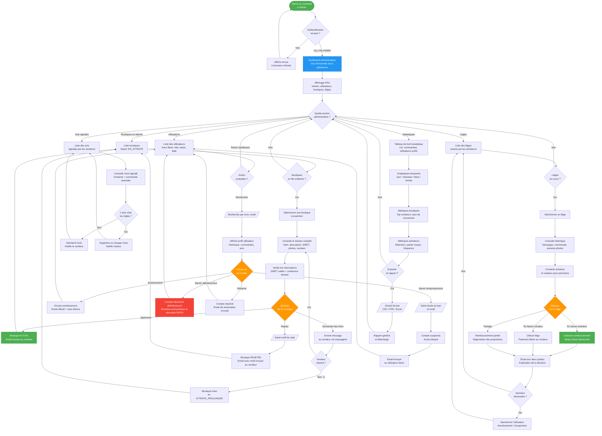

# Diagramme d'Activité - Administration

Description : Ce diagramme décrit le rôle de l'administrateur MarketCraft dans la supervision de la plateforme : validation des boutiques, gestion des litiges, modération des utilisateurs et génération des rapports de performance.

## Légende

| Symbole | Signification |
|---------|---------------|
| Ovale vert `([...])` | Entrée dans le module d'administration |
| Rectangle bleu `D` | Hub central (dashboard) |
| Losange orange `{...}` | Décision administrative |
| Rectangle rouge | Action irréversible (ban définitif) |
| Rectangle vert | Action positive (approbation, remboursement) |

### Sections du panneau d'administration
| Section | Responsabilité |
|---------|----------------|
| **Boutiques** | Valider ou rejeter les demandes de création de boutique |
| **Litiges** | Arbitrer les conflits acheteur/vendeur |
| **Utilisateurs** | Gérer les comptes (ban, débannissement, avertissements) |
| **Avis signalés** | Modérer les contenus inappropriés |
| **Statistiques** | Analyser les performances de la plateforme |

### Indicateurs clés (KPIs) du dashboard
- Chiffre d'affaires total du jour / mois / année
- Nombre de nouvelles inscriptions (acheteurs + vendeurs)
- Boutiques en attente de validation
- Litiges ouverts et non résolus
- Taux de conversion global de la plateforme
- Avis en attente de modération
