# Modèle Conceptuel de Données (MCD) - Merise

Description : Le MCD représente les entités du monde réel de MarketCraft et leurs associations, indépendamment de toute considération technique d'implémentation. Il exprime les règles de gestion métier sous forme de cardinalités et d'associations nommées.

```mermaid
erDiagram
    UTILISATEUR {
        int id PK
        string nom
        string prenom
        string email
        string mot_de_passe_hash
        string telephone
        enum role
        boolean est_actif
        datetime date_inscription
        datetime derniere_connexion
    }

    BOUTIQUE {
        int id PK
        string nom
        string slug
        string description
        string logo
        string banniere
        enum statut
        float note_moyenne
        int nombre_ventes
        string siret
        string adresse
        string ville
        string code_postal
        string pays
        datetime date_creation
    }

    CATEGORIE {
        int id PK
        int parent_id FK
        string nom
        string slug
        string description
        string icone
        int ordre
        boolean est_active
    }

    PRODUIT {
        int id PK
        string nom
        string slug
        string description
        string description_courte
        float prix
        float prix_promo
        int stock
        int stock_minimum
        string images
        string tags
        enum statut
        boolean est_mis_en_avant
        float poids
        string dimensions
        float note_moyenne
        int nombre_avis
        datetime date_creation
    }

    COMMANDE {
        int id PK
        string reference
        enum statut
        float sous_total
        float frais_livraison
        float taxe
        float total
        string mode_livraison
        string numero_suivi
        string notes
        datetime date_commande
        datetime date_expedition
        datetime date_livraison
    }

    LIGNE_COMMANDE {
        int id PK
        string nom_produit_snapshot
        float prix_unitaire_snapshot
        int quantite
        float sous_total
        string options_choisies
    }

    PAIEMENT {
        int id PK
        string stripe_payment_intent_id
        string stripe_charge_id
        float montant
        string devise
        enum statut
        string methode
        string derniers_4_chiffres
        string marque_carte
        datetime date_paiement
        datetime date_remboursement
        string raison_echec
    }

    AVIS {
        int id PK
        int note
        string titre
        string commentaire
        string photos
        boolean est_verifie
        boolean est_visible
        int nombre_utiles
        string reponse_vendeur
        datetime date_creation
        datetime date_reponse_vendeur
    }

    ADRESSE_LIVRAISON {
        int id PK
        string nom
        string prenom
        string entreprise
        string ligne1
        string ligne2
        string ville
        string code_postal
        string region
        string pays
        string telephone
        boolean est_par_defaut
    }

    REFRESH_TOKEN {
        int id PK
        string token
        datetime expire_at
        datetime created_at
        string ip_adresse
    }

    %% ─── ASSOCIATIONS ───

    UTILISATEUR ||--o{ BOUTIQUE : "gère (1,1)-(0,1)"
    UTILISATEUR ||--o{ COMMANDE : "passe (1,1)-(0,N)"
    UTILISATEUR ||--o{ AVIS : "rédige (1,1)-(0,N)"
    UTILISATEUR ||--o{ ADRESSE_LIVRAISON : "possède (1,1)-(0,N)"
    UTILISATEUR ||--o{ REFRESH_TOKEN : "authentifié par (1,1)-(0,N)"

    BOUTIQUE ||--o{ PRODUIT : "possède (1,1)-(1,N)"

    CATEGORIE ||--o{ PRODUIT : "classe (1,1)-(0,N)"
    CATEGORIE |o--o{ CATEGORIE : "contient sous-catégories (0,1)-(0,N)"

    COMMANDE ||--o{ LIGNE_COMMANDE : "composée de (1,1)-(1,N)"
    COMMANDE ||--|| PAIEMENT : "réglée par (1,1)-(1,1)"
    COMMANDE }o--|| ADRESSE_LIVRAISON : "livrée à (0,N)-(1,1)"

    PRODUIT ||--o{ LIGNE_COMMANDE : "référencé dans (1,1)-(0,N)"
    PRODUIT ||--o{ AVIS : "évalué par (1,1)-(0,N)"

    AVIS }o--o| COMMANDE : "issu de (0,N)-(0,1)"
```

## Associations et règles de gestion Merise

### Tableau des associations avec cardinalités

| Association | Entité A | Cardinalité A | Entité B | Cardinalité B | Signification métier |
|-------------|----------|---------------|----------|---------------|----------------------|
| **gère** | UTILISATEUR | (1,1) | BOUTIQUE | (0,1) | Un utilisateur peut gérer au plus une boutique ; une boutique est gérée par exactement un vendeur |
| **passe** | UTILISATEUR | (1,1) | COMMANDE | (0,N) | Un utilisateur peut passer zéro ou plusieurs commandes ; chaque commande appartient à un seul acheteur |
| **rédige** | UTILISATEUR | (1,1) | AVIS | (0,N) | Un utilisateur peut rédiger plusieurs avis ; chaque avis est écrit par un seul utilisateur |
| **possède** | BOUTIQUE | (1,1) | PRODUIT | (1,N) | Une boutique possède au moins un produit ; chaque produit appartient à une seule boutique |
| **classe** | CATEGORIE | (1,1) | PRODUIT | (0,N) | Une catégorie peut contenir zéro ou plusieurs produits ; chaque produit appartient à une seule catégorie |
| **composée de** | COMMANDE | (1,1) | LIGNE_COMMANDE | (1,N) | Une commande est composée d'au moins une ligne ; chaque ligne appartient à une seule commande |
| **réglée par** | COMMANDE | (1,1) | PAIEMENT | (1,1) | Une commande a exactement un paiement et vice versa |
| **livrée à** | COMMANDE | (0,N) | ADRESSE_LIVRAISON | (1,1) | Une adresse peut servir pour plusieurs commandes ; chaque commande a une seule adresse de livraison |
| **référencé dans** | PRODUIT | (1,1) | LIGNE_COMMANDE | (0,N) | Un produit peut apparaître dans plusieurs lignes de commande ; une ligne référence un seul produit |
| **évalué par** | PRODUIT | (1,1) | AVIS | (0,N) | Un produit peut avoir zéro ou plusieurs avis |
| **issu de** | AVIS | (0,N) | COMMANDE | (0,1) | Un avis peut être lié à une commande (achat vérifié) ou non |

## Légende Merise

| Notation | Signification |
|----------|---------------|
| `(1,1)` | Exactement une occurrence (obligatoire et unique) |
| `(0,1)` | Zéro ou une occurrence (optionnel et unique) |
| `(1,N)` | Au moins une occurrence |
| `(0,N)` | Zéro ou plusieurs occurrences |
| `PK` | Clé primaire (identifiant de l'entité) |
| `FK` | Clé étrangère (référence vers une autre entité) |
| Entité | Rectangle représentant un objet du monde réel |
| Association | Lien nommé entre deux ou plusieurs entités |

### Invariants métier (règles de gestion)
1. Un utilisateur avec le rôle `ACHETEUR` ne peut pas créer de boutique.
2. Un `AVIS` ne peut être posté que si l'utilisateur a commandé le produit et que la commande est au statut `LIVREE`.
3. Une `COMMANDE` ne peut être créée que si le stock de chaque produit est suffisant.
4. Le `PAIEMENT` n'est libéré au vendeur qu'après 14 jours sans litige.
5. Un `PRODUIT` archivé ne peut plus être commandé mais reste visible dans les commandes passées.
