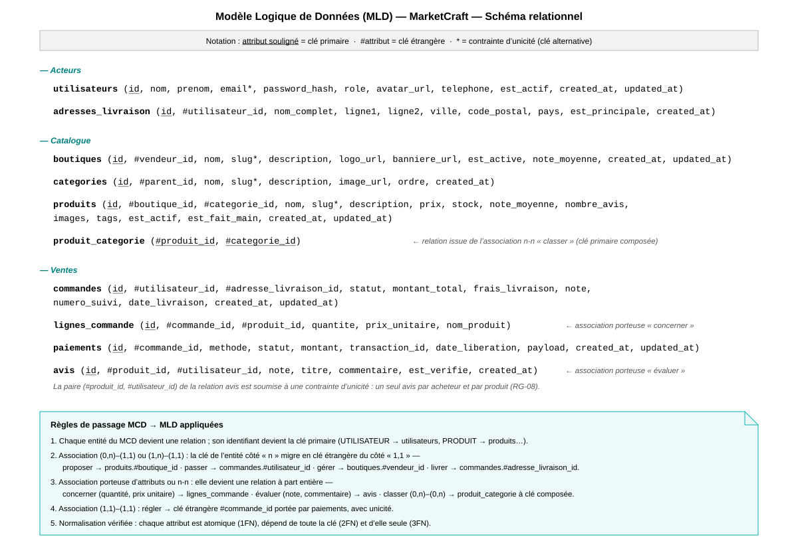

# Modèle Logique de Données (MLD) - Merise

Description : Le MLD traduit le MCD en un modèle relationnel indépendant de tout SGBDR précis. Chaque entité devient une table, chaque association est matérialisée par une clé étrangère placée du côté « plusieurs » de la cardinalité, en respectant les règles de normalisation (1FN, 2FN, 3FN). Les types restent génériques (INT, VARCHAR, DATETIME, ENUM, JSON, BOOLEAN) : la déclinaison technique précise (moteur de stockage, charset, index de performance, contraintes CHECK, script SQL exécutable) est traitée dans le [Modèle Physique de Données (MPD)](13_merise_mpd.md).

> **Version notation relationnelle** : le schéma relationnel du modèle réellement implémenté (base `marketcraft_3eme_dev`, 10 relations dont la liaison n-n `produit_categorie`) est disponible dans [`09_merise_mld.svg`](09_merise_mld.svg), en notation Merise classique — clé primaire soulignée, `#` pour les clés étrangères, `*` pour les unicités — avec le rappel des règles de passage MCD → MLD.



```mermaid
erDiagram
    utilisateurs {
        INT id PK
        VARCHAR_100 nom
        VARCHAR_100 prenom
        VARCHAR_255 email UK
        VARCHAR_255 mot_de_passe_hash
        VARCHAR_20 telephone
        ENUM_role role
        TINYINT_1 est_actif
        VARCHAR_255 token_verification
        VARCHAR_255 token_reset
        DATETIME token_reset_expiration
        INT tentatives_echec
        DATETIME verrouille_jusqu_a
        DATETIME date_inscription
        DATETIME derniere_connexion
    }

    boutiques {
        INT id PK
        INT utilisateur_id FK
        VARCHAR_150 nom
        VARCHAR_150 slug UK
        TEXT description
        VARCHAR_500 logo
        VARCHAR_500 banniere
        ENUM_statut statut
        DECIMAL_3_2 note_moyenne
        INT nombre_ventes
        VARCHAR_14 siret UK
        VARCHAR_255 adresse
        VARCHAR_100 ville
        VARCHAR_10 code_postal
        VARCHAR_3 pays
        DATETIME date_creation
        DATETIME date_mise_a_jour
    }

    categories {
        INT id PK
        INT parent_id FK
        VARCHAR_100 nom
        VARCHAR_100 slug UK
        TEXT description
        VARCHAR_100 icone
        VARCHAR_500 image
        TINYINT ordre
        TINYINT_1 est_active
    }

    produits {
        INT id PK
        INT boutique_id FK
        INT categorie_id FK
        VARCHAR_255 nom
        VARCHAR_255 slug UK
        TEXT description
        VARCHAR_500 description_courte
        DECIMAL_10_2 prix
        DECIMAL_10_2 prix_promo
        INT stock
        INT stock_minimum
        JSON images
        JSON tags
        ENUM_statut statut
        TINYINT_1 est_mis_en_avant
        DECIMAL_8_3 poids
        VARCHAR_50 dimensions
        DECIMAL_3_2 note_moyenne
        INT nombre_avis
        DATETIME date_creation
        DATETIME date_mise_a_jour
    }

    adresses_livraison {
        INT id PK
        INT utilisateur_id FK
        VARCHAR_100 nom
        VARCHAR_100 prenom
        VARCHAR_150 entreprise
        VARCHAR_255 ligne1
        VARCHAR_255 ligne2
        VARCHAR_100 ville
        VARCHAR_10 code_postal
        VARCHAR_100 region
        VARCHAR_3 pays
        VARCHAR_20 telephone
        TINYINT_1 est_par_defaut
        DATETIME date_creation
    }

    commandes {
        INT id PK
        INT acheteur_id FK
        INT adresse_livraison_id FK
        VARCHAR_30 reference UK
        ENUM_statut statut
        DECIMAL_10_2 sous_total
        DECIMAL_10_2 frais_livraison
        DECIMAL_10_2 taxe
        DECIMAL_10_2 total
        ENUM_mode mode_livraison
        VARCHAR_100 numero_suivi
        VARCHAR_50 transporteur
        TEXT notes
        DATETIME date_commande
        DATETIME date_expedition
        DATETIME date_livraison
        DATETIME date_mise_a_jour
    }

    lignes_commande {
        INT id PK
        INT commande_id FK
        INT produit_id FK
        VARCHAR_255 nom_produit_snapshot
        DECIMAL_10_2 prix_unitaire_snapshot
        INT quantite
        DECIMAL_10_2 sous_total
        JSON options_choisies
    }

    paiements {
        INT id PK
        INT commande_id FK UK
        VARCHAR_255 stripe_payment_intent_id UK
        VARCHAR_255 stripe_charge_id
        DECIMAL_10_2 montant
        VARCHAR_3 devise
        ENUM_statut statut
        ENUM_methode methode
        VARCHAR_4 derniers_4_chiffres
        VARCHAR_20 marque_carte
        DATETIME date_paiement
        DATETIME date_remboursement
        DATETIME date_liberation
        TEXT raison_echec
    }

    avis {
        INT id PK
        INT produit_id FK
        INT utilisateur_id FK
        INT commande_id FK
        TINYINT note
        VARCHAR_200 titre
        TEXT commentaire
        JSON photos
        TINYINT_1 est_verifie
        TINYINT_1 est_visible
        INT nombre_utiles
        TEXT reponse_vendeur
        DATETIME date_creation
        DATETIME date_mise_a_jour
        DATETIME date_reponse_vendeur
    }

    refresh_tokens {
        INT id PK
        INT utilisateur_id FK
        VARCHAR_500 token UK
        DATETIME expire_at
        DATETIME created_at
        VARCHAR_45 ip_adresse
        VARCHAR_255 user_agent
        TINYINT_1 est_revoque
    }

    %% ─── RELATIONS MLD ───
    utilisateurs ||--o{ boutiques : "utilisateur_id"
    utilisateurs ||--o{ commandes : "acheteur_id"
    utilisateurs ||--o{ avis : "utilisateur_id"
    utilisateurs ||--o{ adresses_livraison : "utilisateur_id"
    utilisateurs ||--o{ refresh_tokens : "utilisateur_id"

    boutiques ||--o{ produits : "boutique_id"

    categories ||--o{ produits : "categorie_id"
    categories |o--o{ categories : "parent_id"

    commandes ||--o{ lignes_commande : "commande_id"
    commandes ||--|| paiements : "commande_id"
    commandes }o--|| adresses_livraison : "adresse_livraison_id"

    produits ||--o{ lignes_commande : "produit_id"
    produits ||--o{ avis : "produit_id"

    avis }o--o| commandes : "commande_id"
```

---

## Schéma relationnel (notation logique)

Chaque table est décrite par son nom, sa clé primaire (PK), ses clés étrangères (FK) et la règle de gestion associée à la suppression du parent. Cette règle est exprimée ici de façon logique (indépendante du SGBDR) ; sa traduction technique exacte (`ON DELETE CASCADE/RESTRICT/SET NULL`) figure dans le MPD.

| Table | PK | FK → Table référencée | Règle de gestion à la suppression du parent |
|-------|----|------------------------|----------------------------------------------|
| `utilisateurs` | `id` | — | — |
| `refresh_tokens` | `id` | `utilisateur_id` → `utilisateurs` | Suppression en cascade |
| `boutiques` | `id` | `utilisateur_id` → `utilisateurs` | Interdite si des boutiques existent |
| `categories` | `id` | `parent_id` → `categories` | Mise à `NULL` (sous-catégorie orpheline) |
| `produits` | `id` | `boutique_id` → `boutiques`, `categorie_id` → `categories` | Interdite si des produits existent |
| `adresses_livraison` | `id` | `utilisateur_id` → `utilisateurs` | Suppression en cascade |
| `commandes` | `id` | `acheteur_id` → `utilisateurs`, `adresse_livraison_id` → `adresses_livraison` | Interdite si des commandes existent |
| `lignes_commande` | `id` | `commande_id` → `commandes`, `produit_id` → `produits` | Cascade sur la commande, interdite sur le produit |
| `paiements` | `id` | `commande_id` → `commandes` | Interdite (traçabilité financière) |
| `avis` | `id` | `produit_id` → `produits`, `utilisateur_id` → `utilisateurs`, `commande_id` → `commandes` | Cascade sur produit/utilisateur, `NULL` sur commande |

### Normalisation
- **1FN** : tous les attributs sont atomiques (les champs `JSON` comme `images` ou `tags` stockent des collections explicitement non-relationnelles, assumé comme exception technique documentée).
- **2FN** : chaque attribut non-clé dépend de la totalité de la clé primaire (clés primaires simples ici, condition trivialement respectée).
- **3FN** : aucun attribut non-clé ne dépend d'un autre attribut non-clé (ex. `note_moyenne` et `nombre_avis` de `produits` sont des agrégats dénormalisés volontairement pour la performance de lecture — à recalculer par trigger ou job applicatif).

Pour le script SQL exécutable (types précis, index, contraintes `CHECK`, moteur de stockage), voir le [Modèle Physique de Données (MPD)](13_merise_mpd.md).

## Légende MLD

| Notation | Signification |
|----------|---------------|
| `PK` | Clé primaire — identifie de façon unique chaque ligne |
| `FK` | Clé étrangère — référence une clé primaire d'une autre table |
| `UK` | Contrainte d'unicité (UNIQUE KEY) |
| `NOT NULL` | Champ obligatoire |
| `DEFAULT` | Valeur par défaut si non fournie |
| `ON DELETE CASCADE` | Suppression en cascade des enregistrements enfants |
| `ON DELETE RESTRICT` | Interdit la suppression si des enregistrements référencent cette ligne |
| `ON DELETE SET NULL` | Nullifie la clé étrangère si le parent est supprimé |
| `DECIMAL(10,2)` | Nombre décimal avec 10 chiffres au total et 2 après la virgule |
| `JSON` | Champ JSON natif MySQL 8+ pour tableaux et objets |
| `FULLTEXT` | Index de recherche plein texte pour les recherches produits |
| `ENUM` | Liste fermée de valeurs autorisées |
| `snapshot` | Copie de la valeur au moment de la commande (immuable) |
