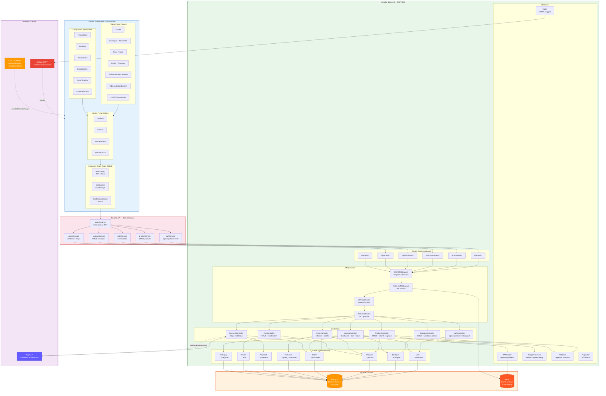

# Diagramme d'Architecture - MarketCraft

Description : Ce diagramme présente l'architecture logicielle complète de MarketCraft, organisée en couches (layers). Il montre comment le frontend React communique avec le backend PHP via une API REST, comment les contrôleurs orchestrent les modèles, et comment les services externes (Stripe, Email) s'intègrent dans le système.

## Légende

### Couches architecturales
| Couche | Couleur | Technologie | Responsabilité |
|--------|---------|-------------|----------------|
| **Présentation** | Bleu | React 18 + Tailwind CSS | Interface utilisateur, état local, routing |
| **API Layer** | Rose | Axios + Intercepteurs | Communication HTTP, gestion des tokens |
| **Backend** | Vert | PHP 8.2 + MVC custom | Logique métier, validation, orchestration |
| **Données** | Orange | MySQL 8 + Redis | Persistance, cache, sessions |
| **Services externes** | Violet | Stripe, Mailgun, CDN | Paiement, email, assets |

### Flux de données principaux
| Flux | Description |
|------|-------------|
| `Contextes → axiosInstance` | Tous les appels API passent par l'instance centralisée qui injecte le JWT |
| `MW1 → MW2` | Toute requête est d'abord authentifiée puis ses permissions sont vérifiées |
| `Controller → Utils` | Les contrôleurs délèguent les opérations techniques aux utilitaires |
| `Stripe → Webhook → CT7` | Stripe notifie le backend des événements de paiement en temps réel |
| `REDIS ← MW3` | Le rate limiting utilise Redis pour compter les requêtes par IP |

### Principes d'architecture
- **Séparation des préoccupations** : chaque couche a une responsabilité unique
- **Stateless API** : le backend ne stocke pas l'état de session (JWT)
- **Pattern Repository** implicite dans les modèles (Active Record)
- **Intercepteurs Axios** : gestion centralisée du refresh token
- **Snapshots de prix** : les prix sont copiés dans `lignes_commande` pour l'immuabilité historique
