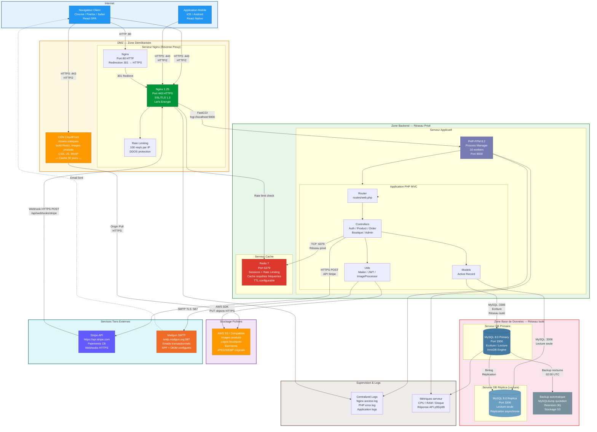

# Diagramme de Déploiement - MarketCraft

Description : Ce diagramme représente l'infrastructure physique et logique de déploiement de MarketCraft en production. Il montre comment les différents nœuds matériels et logiciels communiquent entre eux, les protocoles utilisés, et l'organisation en zones de sécurité (DMZ, réseau interne).

## Légende

### Zones de sécurité réseau
| Zone | Description | Accès |
|------|-------------|-------|
| **Internet** | Clients finaux (navigateurs, mobiles) | Public |
| **DMZ** | Reverse proxy exposé publiquement | Port 80/443 uniquement |
| **Zone Backend** | Serveurs applicatifs PHP + Redis | Depuis DMZ uniquement |
| **Zone DB** | Bases de données MySQL | Depuis Backend uniquement |
| **Stockage** | Fichiers binaires S3 | Backend (écriture) + CDN (lecture) |
| **Externe** | APIs tierces (Stripe, Mailgun) | Sortant depuis Backend |

### Composants d'infrastructure
| Composant | Version | Port | Rôle |
|-----------|---------|------|------|
| **Nginx** | 1.25 | 443 (HTTPS) | Reverse proxy, SSL termination, compression gzip |
| **PHP-FPM** | 8.2 | 9000 (FastCGI) | Exécution de l'application PHP |
| **MySQL Primary** | 8.0 | 3306 | Base de données principale (lectures + écritures) |
| **MySQL Replica** | 8.0 | 3306 | Réplique lecture (scalabilité horizontale) |
| **Redis** | 7 | 6379 | Cache sessions, rate limiting, cache requêtes |
| **AWS S3** | — | HTTPS | Stockage objet pour les fichiers uploadés |
| **CloudFront CDN** | — | 443 | Distribution des assets statiques |

### Protocoles de communication
| Connexion | Protocole | Sécurité |
|-----------|-----------|----------|
| Client → Nginx | HTTPS / HTTP2 | TLS 1.3, certificat Let's Encrypt |
| Nginx → PHP-FPM | FastCGI | Réseau local (127.0.0.1) |
| PHP → Redis | TCP | Réseau privé interne |
| PHP → MySQL | TCP MySQL | Réseau isolé, authentification |
| PHP → Stripe | HTTPS REST | TLS 1.2+, clé API secrète |
| PHP → Mailgun | SMTP TLS | Port 587, authentification SMTP |
| Stripe → Nginx | HTTPS Webhook | Signature HMAC vérifiée |
