# Diagramme de Cas d'Utilisation UML

Description : Ce diagramme représente les cas d'utilisation de MarketCraft selon la notation UML, en identifiant les trois acteurs principaux (Acheteur, Vendeur, Admin) et l'ensemble de leurs interactions avec le système, avec les relations include (fonctionnalité obligatoire) et extend (fonctionnalité optionnelle).

```mermaid
graph LR
    %% ─── ACTEURS ───
    ACHETEUR(["👤 Acheteur"])
    VENDEUR(["🏪 Vendeur"])
    ADMIN(["🛡️ Admin"])
    SYSTEME(["🤖 Système\n(automatismes)"])
    STRIPE(["💳 Stripe\n(acteur externe)"])

    subgraph SYSTEME_MARKETCRAFT["Système MarketCraft"]

        subgraph UC_AUTH["Authentification"]
            UC1["S'inscrire"]
            UC2["Se connecter"]
            UC3["Vérifier son email"]
            UC4["Réinitialiser mot de passe"]
            UC5["Se déconnecter"]
            UC6["Rafraîchir token JWT"]
        end

        subgraph UC_CATALOGUE["Catalogue & Recherche"]
            UC7["Parcourir le catalogue"]
            UC8["Rechercher un produit"]
            UC9["Filtrer par catégorie"]
            UC10["Trier les résultats"]
            UC11["Consulter une fiche produit"]
            UC12["Consulter une boutique"]
            UC13["Voir les avis d'un produit"]
        end

        subgraph UC_PANIER["Panier & Commande"]
            UC14["Gérer son panier"]
            UC15["Ajouter au panier"]
            UC16["Modifier quantité panier"]
            UC17["Supprimer du panier"]
            UC18["Passer commande"]
            UC19["Choisir adresse de livraison"]
            UC20["Choisir mode de livraison"]
            UC21["Payer sa commande"]
            UC22["Annuler une commande"]
        end

        subgraph UC_COMPTE_ACHETEUR["Compte Acheteur"]
            UC23["Gérer son profil"]
            UC24["Gérer ses adresses"]
            UC25["Consulter ses commandes"]
            UC26["Suivre une commande"]
            UC27["Laisser un avis"]
            UC28["Signaler un litige"]
        end

        subgraph UC_BOUTIQUE["Gestion Boutique (Vendeur)"]
            UC29["Créer sa boutique"]
            UC30["Modifier sa boutique"]
            UC31["Consulter statistiques boutique"]
            UC32["Gérer les promotions"]
        end

        subgraph UC_PRODUITS["Gestion Produits (Vendeur)"]
            UC33["Créer un produit"]
            UC34["Modifier un produit"]
            UC35["Publier / dépublier un produit"]
            UC36["Gérer le stock"]
            UC37["Uploader des images"]
            UC38["Archiver un produit"]
        end

        subgraph UC_COMMANDES_VENDEUR["Gestion Commandes (Vendeur)"]
            UC39["Consulter ses commandes"]
            UC40["Préparer une commande"]
            UC41["Enregistrer l'expédition"]
            UC42["Répondre à un avis"]
            UC43["Gérer un litige client"]
        end

        subgraph UC_FINANCES["Finances (Vendeur)"]
            UC44["Consulter ses revenus"]
            UC45["Voir l'historique des paiements"]
        end

        subgraph UC_ADMIN["Administration"]
            UC46["Se connecter en admin"]
            UC47["Valider une boutique"]
            UC48["Rejeter une boutique"]
            UC49["Suspendre une boutique"]
            UC50["Gérer les utilisateurs"]
            UC51["Bannir un utilisateur"]
            UC52["Débannir un utilisateur"]
            UC53["Arbitrer un litige"]
            UC54["Modérer les avis"]
            UC55["Consulter les statistiques plateforme"]
            UC56["Exporter des rapports"]
        end

        subgraph UC_SYSTEME["Automatismes Système"]
            UC57["Envoyer email confirmation commande"]
            UC58["Envoyer email expédition"]
            UC59["Libérer paiement vendeur\n(J+14 après livraison)"]
            UC60["Notifier rupture de stock"]
            UC61["Traiter webhook Stripe"]
        end
    end

    %% ─────────────────────────────────────────────
    %% ACHETEUR — associations
    %% ─────────────────────────────────────────────
    ACHETEUR --- UC1
    ACHETEUR --- UC2
    ACHETEUR --- UC4
    ACHETEUR --- UC5
    ACHETEUR --- UC7
    ACHETEUR --- UC8
    ACHETEUR --- UC11
    ACHETEUR --- UC12
    ACHETEUR --- UC14
    ACHETEUR --- UC18
    ACHETEUR --- UC21
    ACHETEUR --- UC22
    ACHETEUR --- UC23
    ACHETEUR --- UC24
    ACHETEUR --- UC25
    ACHETEUR --- UC26
    ACHETEUR --- UC27
    ACHETEUR --- UC28

    %% ─────────────────────────────────────────────
    %% VENDEUR — associations (inclut celles acheteur)
    %% ─────────────────────────────────────────────
    VENDEUR --- UC1
    VENDEUR --- UC2
    VENDEUR --- UC5
    VENDEUR --- UC29
    VENDEUR --- UC30
    VENDEUR --- UC31
    VENDEUR --- UC32
    VENDEUR --- UC33
    VENDEUR --- UC34
    VENDEUR --- UC35
    VENDEUR --- UC36
    VENDEUR --- UC37
    VENDEUR --- UC38
    VENDEUR --- UC39
    VENDEUR --- UC40
    VENDEUR --- UC41
    VENDEUR --- UC42
    VENDEUR --- UC43
    VENDEUR --- UC44
    VENDEUR --- UC45

    %% ─────────────────────────────────────────────
    %% ADMIN — associations
    %% ─────────────────────────────────────────────
    ADMIN --- UC46
    ADMIN --- UC47
    ADMIN --- UC48
    ADMIN --- UC49
    ADMIN --- UC50
    ADMIN --- UC51
    ADMIN --- UC52
    ADMIN --- UC53
    ADMIN --- UC54
    ADMIN --- UC55
    ADMIN --- UC56

    %% ─────────────────────────────────────────────
    %% SYSTEME — associations
    %% ─────────────────────────────────────────────
    SYSTEME --- UC57
    SYSTEME --- UC58
    SYSTEME --- UC59
    SYSTEME --- UC60
    SYSTEME --- UC61

    %% ─────────────────────────────────────────────
    %% STRIPE — associations
    %% ─────────────────────────────────────────────
    STRIPE --- UC61

    %% ─────────────────────────────────────────────
    %% RELATIONS INCLUDE (obligatoires)
    %% ─────────────────────────────────────────────
    UC8 -.->|"<<include>>"| UC9
    UC8 -.->|"<<include>>"| UC10
    UC18 -.->|"<<include>>"| UC19
    UC18 -.->|"<<include>>"| UC20
    UC18 -.->|"<<include>>"| UC21
    UC21 -.->|"<<include>>"| UC61
    UC33 -.->|"<<include>>"| UC37
    UC41 -.->|"<<include>>"| UC36
    UC53 -.->|"<<include>>"| UC51
    UC47 -.->|"<<include>>"| UC57
    UC2 -.->|"<<include>>"| UC6

    %% ─────────────────────────────────────────────
    %% RELATIONS EXTEND (optionnelles)
    %% ─────────────────────────────────────────────
    UC27 -.->|"<<extend>>"| UC25
    UC28 -.->|"<<extend>>"| UC25
    UC3 -.->|"<<extend>>"| UC1
    UC22 -.->|"<<extend>>"| UC25
    UC32 -.->|"<<extend>>"| UC34
    UC42 -.->|"<<extend>>"| UC39
    UC56 -.->|"<<extend>>"| UC55
    UC60 -.->|"<<extend>>"| UC36

    %% ─── STYLES ───
    style ACHETEUR fill:#2196F3,color:#fff,stroke:#1565C0,stroke-width:3px
    style VENDEUR fill:#4CAF50,color:#fff,stroke:#2E7D32,stroke-width:3px
    style ADMIN fill:#F44336,color:#fff,stroke:#C62828,stroke-width:3px
    style SYSTEME fill:#9E9E9E,color:#fff,stroke:#616161,stroke-width:2px
    style STRIPE fill:#635BFF,color:#fff,stroke:#483BCC,stroke-width:2px

    style UC_AUTH fill:#E3F2FD,stroke:#1565C0
    style UC_CATALOGUE fill:#E8F5E9,stroke:#2E7D32
    style UC_PANIER fill:#FFF3E0,stroke:#E65100
    style UC_COMPTE_ACHETEUR fill:#E3F2FD,stroke:#1565C0
    style UC_BOUTIQUE fill:#E8F5E9,stroke:#2E7D32
    style UC_PRODUITS fill:#E8F5E9,stroke:#2E7D32
    style UC_COMMANDES_VENDEUR fill:#E8F5E9,stroke:#2E7D32
    style UC_FINANCES fill:#E8F5E9,stroke:#2E7D32
    style UC_ADMIN fill:#FCE4EC,stroke:#C62828
    style UC_SYSTEME fill:#EFEBE9,stroke:#4E342E
```

## Légende

### Acteurs
| Acteur | Couleur | Description |
|--------|---------|-------------|
| **Acheteur** | Bleu | Utilisateur final qui consulte et achète des produits artisanaux |
| **Vendeur** | Vert | Artisan qui crée sa boutique et vend ses créations |
| **Admin** | Rouge | Modérateur qui supervise la plateforme et arbitre les litiges |
| **Système** | Gris | Automatismes déclenchés sans intervention humaine (emails, libération paiement) |
| **Stripe** | Violet | Acteur externe qui traite les paiements et envoie des webhooks |

### Relations UML
| Relation | Notation | Signification |
|----------|----------|---------------|
| **Association** | `---` | L'acteur peut réaliser ce cas d'utilisation |
| **Include** | `<<include>>` | Le cas d'utilisation A inclut toujours le cas B (obligatoire) |
| **Extend** | `<<extend>>` | Le cas d'utilisation B peut étendre le cas A (optionnel, conditionnel) |

### Cas d'utilisation par acteur

#### Acheteur (18 cas)
Authentification, catalogue, panier, commande, paiement, compte, suivi, avis, litiges

#### Vendeur (20 cas)
Tout ce que peut faire l'acheteur + gestion boutique, produits, commandes, finances

#### Admin (11 cas)
Connexion dédiée, validation boutiques, gestion utilisateurs, arbitrage litiges, statistiques, exports

#### Système (5 automatismes)
Emails transactionnels, libération paiement automatique, gestion stock, webhooks Stripe

### Exemples de relations importantes
- `Rechercher` **include** `Filtrer par catégorie` : toute recherche permet toujours de filtrer
- `Passer commande` **include** `Payer` : impossible de commander sans payer
- `Laisser un avis` **extend** `Consulter ses commandes` : l'avis est accessible depuis la commande
- `S'inscrire` **extend** `Vérifier son email` : la vérification est proposée après l'inscription
