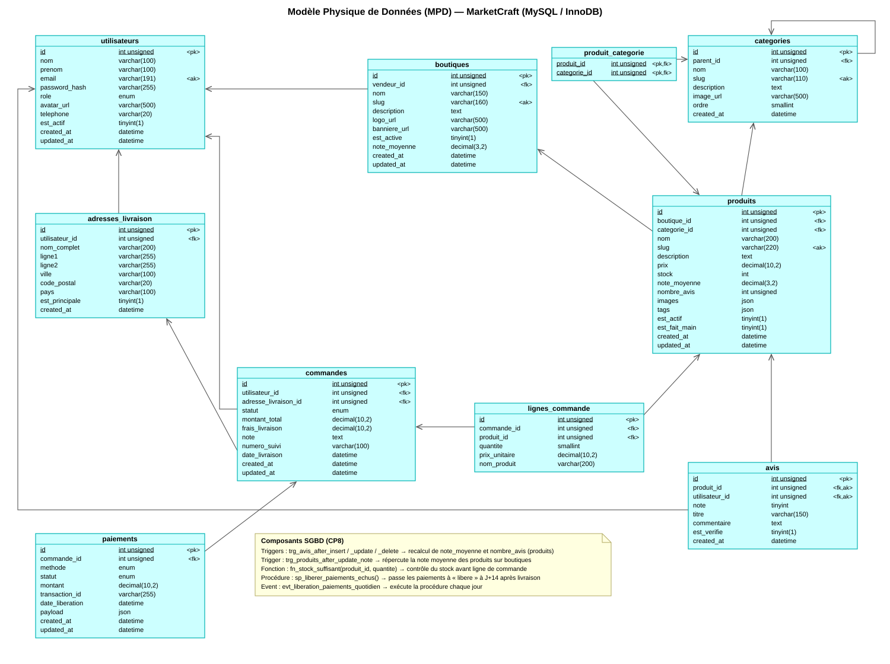

# Modèle Physique de Données (MPD) - Merise

Description : Le MPD traduit le [MLD](09_merise_mld.md) en un schéma directement implémentable sur le SGBDR cible (MySQL 8.0+). Il fige tous les choix techniques que le MLD laisse encore ouverts : types de colonnes exacts et leur précision, moteur de stockage, encodage et collation, index de performance, contraintes d'intégrité (`CHECK`), et actions référentielles précises (`ON DELETE` / `ON UPDATE`). Ce document constitue le script SQL exécutable de référence pour créer la base `marketcraft`.

> **Version PowerAMC** : une représentation graphique du schéma réellement implémenté (base `marketcraft_3eme_dev`, 9 tables, marqueurs `<pk>` / `<fk>` / `<ak>`, liens de référence et composants SGBD) est disponible dans [`13_merise_mpd.svg`](13_merise_mpd.svg).



## Script SQL DDL - Création des tables

```sql
-- ============================================================
-- MarketCraft — Schéma de base de données MySQL 8.0+
-- Encodage : UTF8MB4 | Moteur : InnoDB | Collation : utf8mb4_unicode_ci
-- ============================================================

-- ============================================================
-- MarketCraft — Schéma de base de données MySQL 8.0+ (Optimisé)
-- Encodage : UTF8MB4 | Moteur : InnoDB | Collation : utf8mb4_unicode_ci
-- ============================================================

SET FOREIGN_KEY_CHECKS = 0;
SET sql_mode = 'STRICT_TRANS_TABLES,NO_ZERO_DATE,NO_ZERO_IN_DATE,ERROR_FOR_DIVISION_BY_ZERO';

-- ─────────────────────────────────────────────────────────────
-- TABLE : utilisateurs
-- ─────────────────────────────────────────────────────────────
CREATE TABLE utilisateurs (
    id                     INT UNSIGNED        NOT NULL AUTO_INCREMENT,
    nom                    VARCHAR(100)        NOT NULL,
    prenom                 VARCHAR(100)        NOT NULL,
    email                  VARCHAR(255)        NOT NULL,
    mot_de_passe_hash      VARCHAR(255)        NOT NULL,
    telephone              VARCHAR(20)                  DEFAULT NULL,
    role                   ENUM('ACHETEUR','VENDEUR','ADMIN','SUPER_ADMIN')
                                                NOT NULL DEFAULT 'ACHETEUR',
    est_actif              TINYINT(1)          NOT NULL DEFAULT 0,
    -- Optimisation : Taille fixe pour des tokens de type Hash/UUID et indexation unique
    token_verification     CHAR(64)                     DEFAULT NULL,
    token_reset            CHAR(64)                     DEFAULT NULL,
    token_reset_expiration DATETIME                     DEFAULT NULL,
    tentatives_echec       TINYINT UNSIGNED    NOT NULL DEFAULT 0,
    verrouille_jusqu_a     DATETIME                     DEFAULT NULL,
    date_inscription       DATETIME            NOT NULL DEFAULT CURRENT_TIMESTAMP,
    derniere_connexion     DATETIME                     DEFAULT NULL,

    PRIMARY KEY (id),
    UNIQUE KEY uk_utilisateurs_email (email),
    UNIQUE KEY uk_utilisateurs_token_verification (token_verification),
    UNIQUE KEY uk_utilisateurs_token_reset (token_reset),
    INDEX idx_utilisateurs_role (role),
    INDEX idx_utilisateurs_est_actif (est_actif)
) ENGINE=InnoDB DEFAULT CHARSET=utf8mb4 COLLATE=utf8mb4_unicode_ci;

-- ... [refresh_tokens, boutiques, categories, produits, adresses_livraison, commandes, lignes_commande, paiements restent globalement inchangés ou appliquent les mêmes principes] ...

-- ─────────────────────────────────────────────────────────────
-- TABLE : avis (Version corrigée sans index redondant)
-- ─────────────────────────────────────────────────────────────
CREATE TABLE avis (
    id                      INT UNSIGNED    NOT NULL AUTO_INCREMENT,
    produit_id              INT UNSIGNED    NOT NULL,
    utilisateur_id          INT UNSIGNED    NOT NULL,
    commande_id             INT UNSIGNED             DEFAULT NULL,
    note                    TINYINT UNSIGNED NOT NULL,
    titre                   VARCHAR(200)             DEFAULT NULL,
    commentaire             TEXT                     DEFAULT NULL,
    photos                  JSON                     DEFAULT NULL,
    est_verifie             TINYINT(1)      NOT NULL DEFAULT 0,
    est_visible             TINYINT(1)      NOT NULL DEFAULT 1,
    nombre_utiles           INT UNSIGNED    NOT NULL DEFAULT 0,
    reponse_vendeur         TEXT                     DEFAULT NULL,
    date_creation           DATETIME        NOT NULL DEFAULT CURRENT_TIMESTAMP,
    date_mise_a_jour        DATETIME        NOT NULL DEFAULT CURRENT_TIMESTAMP ON UPDATE CURRENT_TIMESTAMP,
    date_reponse_vendeur    DATETIME                 DEFAULT NULL,

    PRIMARY KEY (id),
    -- Cet index composite couvre déjà nativement les recherches par `utilisateur_id` seul !
    UNIQUE KEY uk_avis_utilisateur_produit (utilisateur_id, produit_id), 
    INDEX idx_avis_produit (produit_id),
    INDEX idx_avis_commande (commande_id),
    INDEX idx_avis_note (note),
    INDEX idx_avis_est_visible (est_visible),
    
    CONSTRAINT fk_avis_produit FOREIGN KEY (produit_id) REFERENCES produits(id) ON DELETE CASCADE ON UPDATE CASCADE,
    CONSTRAINT fk_avis_utilisateur FOREIGN KEY (utilisateur_id) REFERENCES utilisateurs(id) ON DELETE CASCADE ON UPDATE CASCADE,
    CONSTRAINT fk_avis_commande FOREIGN KEY (commande_id) REFERENCES commandes(id) ON DELETE SET NULL ON UPDATE CASCADE,
    CONSTRAINT chk_avis_note CHECK (note BETWEEN 1 AND 5)
) ENGINE=InnoDB DEFAULT CHARSET=utf8mb4 COLLATE=utf8mb4_unicode_ci;

SET FOREIGN_KEY_CHECKS = 1;
```

---

## Composants programmables SGBD (triggers, fonction, procédure, event)

Au-delà des tables et contraintes déclaratives, le MPD embarque une couche de logique métier exécutée directement par le SGBD, indépendamment du code PHP applicatif. Cette logique est implémentée dans `marketcraft-backend/migrations.sql` et vise deux objectifs : garantir la cohérence de données dérivées (notes moyennes) même en cas d'écriture SQL directe, et automatiser une tâche métier récurrente (libération des paiements).

### Triggers de recalcul de note moyenne

| Trigger | Événement | Action |
|---------|-----------|--------|
| `trg_avis_after_insert` | `AFTER INSERT ON avis` | Recalcule `produits.note_moyenne` (moyenne des notes) et `produits.nombre_avis` (COUNT) pour le produit concerné |
| `trg_avis_after_update` | `AFTER UPDATE ON avis` | Idem, recalcul déclenché si la note d'un avis existant est modifiée |
| `trg_avis_after_delete` | `AFTER DELETE ON avis` | Idem, recalcul déclenché après suppression d'un avis (avec `COALESCE(..., 0)` pour remettre `note_moyenne` à 0 si le produit n'a plus aucun avis) |
| `trg_produits_after_update_note` | `AFTER UPDATE ON produits` | Si `note_moyenne` a changé, recalcule en cascade `boutiques.note_moyenne` (moyenne des `note_moyenne` des produits actifs de la boutique) |

Ces quatre triggers forment une chaîne de propagation `avis → produits → boutiques` : un avis client met automatiquement à jour la note du produit, qui met à jour la note de la boutique, sans intervention du code applicatif. Cela garantit la cohérence même si les données sont modifiées par un script d'administration ou une requête SQL directe.

### Fonction de vérification de stock

`fn_stock_suffisant(p_produit_id INT UNSIGNED, p_quantite INT) RETURNS BOOLEAN` — fonction `DETERMINISTIC` / `READS SQL DATA` qui vérifie que le stock disponible d'un produit couvre la quantité demandée. Utilisable directement dans une clause `WHERE` ou dans le code applicatif via une requête `SELECT fn_stock_suffisant(...)`, pour centraliser la règle de gestion « stock suffisant » à un seul endroit.

### Procédure et event de libération des paiements (J+14)

`sp_liberer_paiements_echus()` implémente la règle métier : un paiement au statut `valide` dont la commande associée est livrée (`date_livraison` non nulle) depuis au moins 14 jours passe automatiquement au statut `libere` (avec horodatage dans `date_liberation`). Cette procédure protège l'acheteur (délai de rétractation/réclamation) tout en automatisant le virement des fonds au vendeur passé ce délai.

`evt_liberation_paiements_quotidien` est un `EVENT` MySQL planifié (`ON SCHEDULE EVERY 1 DAY`) qui appelle cette procédure chaque jour, remplaçant un cron job externe par une tâche planifiée directement au niveau du SGBD (nécessite `SET GLOBAL event_scheduler = ON`).

### Schéma associé

Colonnes ajoutées pour supporter ces composants : `produits.note_moyenne`, `produits.nombre_avis`, `boutiques.note_moyenne`, `commandes.date_livraison`, `paiements.date_liberation`, et extension de l'ENUM `paiements.statut` avec la valeur `libere`.

> Le script complet (triggers, fonction, procédure, event, données de test et instructions de vérification manuelle) se trouve dans `marketcraft-backend/migrations.sql`, section « Composants SGBD (CP8) ».

## Choix techniques et justification

| Choix physique | Valeur retenue | Justification |
|-----------------|-----------------|----------------|
| Moteur de stockage | `InnoDB` | Seul moteur MySQL supportant les clés étrangères, les transactions ACID et le row-level locking, indispensable pour les paiements et le stock |
| Encodage / collation | `utf8mb4` / `utf8mb4_unicode_ci` | Support complet Unicode (emojis, accents, caractères multi-octets) et tri linguistique correct |
| Clés primaires | `INT UNSIGNED AUTO_INCREMENT` | Entiers auto-incrémentés, suffisants au volume attendu, plus performants qu'un UUID pour les jointures et l'index clusterisé InnoDB |
| `DECIMAL(10,2)` pour les montants | Précision exacte, pas d'arrondi flottant | Obligatoire pour toute donnée monétaire (prix, totaux, paiements) |
| `JSON` (images, tags, options_choisies, photos) | Type natif MySQL 8+ | Évite une table de jointure pour des collections de taille variable peu interrogées individuellement |
| `ENUM` pour les statuts | Liste fermée en base | Garantit l'intégrité des valeurs de statut sans table de référence supplémentaire, au prix d'une migration ALTER en cas d'ajout de valeur |
| `FULLTEXT INDEX` sur `produits` | Recherche texte native | Évite une dépendance à un moteur de recherche externe (Elasticsearch) pour le MVP |
| Index composites (ex. `idx_adresses_par_defaut`) | Sur les couples de colonnes filtrées ensemble | Optimise les requêtes fréquentes (ex. adresse par défaut d'un utilisateur) |
| `snapshot` dans `lignes_commande` | Duplication du nom/prix produit | Garantit l'immuabilité de l'historique de commande même si le produit change de prix ou est supprimé ensuite |

## Stratégie d'indexation

- **Clés primaires** : index clusterisé InnoDB sur `id` pour chaque table (recherche et jointure directes).
- **Clés étrangères** : toujours indexées explicitement (MySQL ne le fait pas automatiquement dans tous les cas) pour accélérer les jointures et les vérifications de contrainte.
- **Colonnes de filtrage fréquent** : `statut`, `est_actif`, `est_visible` — index simples pour les clauses `WHERE` des dashboards vendeur/admin.
- **Recherche texte** : `FULLTEXT INDEX ft_produits_search` sur `nom` et `description_courte` pour `MATCH ... AGAINST`.
- **Unicité métier** : `UNIQUE KEY` sur `email`, `slug`, `reference`, `siret`, `token` — empêche les doublons au niveau base, en complément de la validation applicative.

## Légende MPD

| Notation | Signification |
|----------|---------------|
| `PK` | Clé primaire — identifie de façon unique chaque ligne |
| `FK` | Clé étrangère — référence une clé primaire d'une autre table |
| `UK` | Contrainte d'unicité (`UNIQUE KEY`) |
| `NOT NULL` | Champ obligatoire |
| `DEFAULT` | Valeur par défaut si non fournie |
| `ON DELETE CASCADE` | Suppression en cascade des enregistrements enfants |
| `ON DELETE RESTRICT` | Interdit la suppression si des enregistrements référencent cette ligne |
| `ON DELETE SET NULL` | Nullifie la clé étrangère si le parent est supprimé |
| `ENGINE=InnoDB` | Moteur de stockage transactionnel avec support des clés étrangères |
| `DEFAULT CHARSET=utf8mb4` | Encodage Unicode complet (4 octets par caractère) |
| `DECIMAL(10,2)` | Nombre décimal avec 10 chiffres au total et 2 après la virgule |
| `JSON` | Champ JSON natif MySQL 8+ pour tableaux et objets |
| `FULLTEXT` | Index de recherche plein texte pour les recherches produits |
| `ENUM` | Liste fermée de valeurs autorisées |
| `CHECK` | Contrainte de validation au niveau base (ex. prix positif) |
| `snapshot` | Copie de la valeur au moment de la commande (immuable) |
